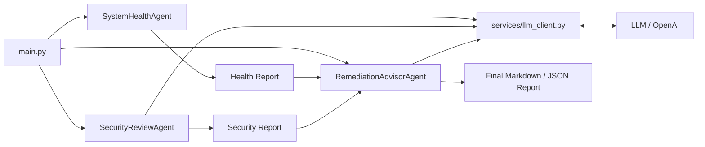

# Agents

This document is bilingual. English content comes first, and Turkish content appears below it.

## English

This project contains three specialized AI agents. All three use the same LLM infrastructure, but each works with different inputs and produces a different kind of report.

### 1. SystemHealthAgent

File:

- `agents/system_health_agent.py`

Responsibilities:

- inspect system health
- identify capacity and resource risks
- interpret service status and operational signals
- write a readable health report for the operator

Main focus areas:

- disk usage
- disk I/O
- memory usage
- uptime
- service status
- failed services
- Docker health and container visibility
- network health
- kernel error logs
- logrotate status
- nginx service state and nginx logs
- system logs
- inode information
- swap information
- size breakdowns for `/` and `/var/log`

Tool layer used:

- `tools/system_health/system_health_tools.py`
- `tools/system_health/system_health_allowlisted_actions.py`

### 2. SecurityReviewAgent

File:

- `agents/security_agent.py`

Responsibilities:

- inspect access and security signals
- identify potential security risks
- interpret exposed services and session activity
- write a security-focused report for the operator

Main focus areas:

- active sessions
- recent successful logins
- recent failed logins
- open ports
- firewall status
- SSH logs
- sudo activity
- SSH config audit
- cron security visibility
- world-writable file scanning
- user and sudo group auditing
- fail2ban status
- Docker security visibility

Tool layer used:

- `tools/security/security_tools.py`
- `tools/security/security_allowlisted_actions.py`

### 3. RemediationAdvisorAgent

File:

- `agents/remediation_advisor_agent.py`

Responsibilities:

- read both the health and security reports together
- prioritize findings
- produce an actionable operator plan
- highlight low-risk verification steps
- separate items that require manual approval

Tool layer used:

- `tools/remediation/remediation_tools.py`

This agent does not collect Linux data directly. Instead, it uses the structured outputs of the first two agents and turns them into a remediation plan.

### Why three agents?

The reason for using three agents is to separate expertise clearly.

This helps the system:

- keep each agent focused on a clear role
- keep prompts simpler
- separate data collection by domain
- produce more understandable reports
- split findings from remediation planning

### How the agents work

The overall flow is:

1. `SystemHealthAgent` collects operational health data and writes a health report
2. `SecurityReviewAgent` collects access/security data and writes a security report
3. `RemediationAdvisorAgent` reads both reports and creates a remediation plan
4. `main.py` combines all outputs into the final report

The agents do not talk to each other directly. `main.py` orchestrates all three and combines their outputs.

### Agent flow diagram

### Summary

The agent design in this project follows a "specialized agents under a shared orchestrator" approach instead of "one agent does everything." With the third agent, the system now produces not only findings, but also an action plan.

## Turkce

Bu projede uc uzman AI agent bulunur. Her agent ayni LLM altyapisini kullanir, ancak farkli veri kaynaklariyla calisir ve farkli bir rapor uretir.

### 1. SystemHealthAgent

Dosya:

- `agents/system_health_agent.py`

Gorevi:

- sistem sagligini incelemek
- kapasite ve kaynak risklerini belirlemek
- servis durumlarini yorumlamak
- operator icin okunabilir bir saglik raporu yazmak

Baktigi baslica alanlar:

- disk kullanimi
- disk I/O
- RAM kullanimi
- uptime
- servis durumlari
- failed service listesi
- Docker health ve container gorunumu
- network health
- kernel error loglari
- logrotate durumu
- nginx servis durumu ve nginx loglari
- sistem loglari
- inode bilgisi
- swap bilgisi
- root ve `/var/log` boyut kirilimlari

Kullandigi tool katmani:

- `tools/system_health/system_health_tools.py`
- `tools/system_health/system_health_allowlisted_actions.py`

### 2. SecurityReviewAgent

Dosya:

- `agents/security_agent.py`

Gorevi:

- erisim ve guvenlik sinyallerini incelemek
- potansiyel riskleri belirlemek
- acik servis ve oturum gorunumunu yorumlamak
- operator icin guvenlik odakli bir rapor yazmak

Baktigi baslica alanlar:

- aktif oturumlar
- son basarili loginler
- son basarisiz loginler
- acik portlar
- firewall durumu
- SSH loglari
- sudo activity
- SSH config audit
- cron guvenlik gorunumu
- world-writable dosya taramasi
- kullanici ve sudo grup denetimi
- fail2ban durumu
- Docker security gorunumu

Kullandigi tool katmani:

- `tools/security/security_tools.py`
- `tools/security/security_allowlisted_actions.py`

### 3. RemediationAdvisorAgent

Dosya:

- `agents/remediation_advisor_agent.py`

Gorevi:

- system health ve security raporlarini birlikte okumak
- bulgulari onceliklendirmek
- operator icin uygulanabilir aksiyon plani cikarmak
- low-risk verification adimlarini one cikarmak
- manuel onay gerektiren maddeleri ayri gostermek

Kullandigi tool katmani:

- `tools/remediation/remediation_tools.py`

Bu agent dogrudan Linux komutu toplamaz. Onun yerine ilk iki agentin yapilandirilmis ciktilarini kullanir ve bunlari tek bir remediation planina donusturur.

### Neden Uc Agent Var?

Bu projede uc agent olmasinin nedeni uzmanlik alanlarini ayirmaktir.

Bu sayede:

- her agent daha net bir role sahip olur
- promptlar daha sade kalir
- veri toplama katmani alan bazli ayrilir
- raporlar daha tutarli ve anlasilir olur
- tespit ile aksiyon plani ayri katmanlara bolunur

### Agentlar Nasil Calisir?

Agentlar genel olarak su akisi izler:

1. `SystemHealthAgent` kendi alanina ait verileri toplar ve health raporu uretir
2. `SecurityReviewAgent` kendi alanina ait verileri toplar ve security raporu uretir
3. `RemediationAdvisorAgent` ilk iki raporu okuyup remediation plani uretir
4. `main.py` tum ciktilari birlestirir

Bu agentlar dogrudan birbirleriyle konusmaz. Ucunu de `main.py` calistirir ve ciktilari birlestirir.

### Agent Akis Diyagrami

### Ozet

Bu projedeki agent yapisi, "tek agent her isi yapsin" yaklasimi yerine "uzman agentlar ortak orkestrator altinda calissin" anlayisi ile tasarlanmistir. Ucuncu agent ile birlikte sistem sadece tespit yapan degil, ayni zamanda aksiyon plani ureten bir yapiya donusmustur.
